# Alexander Nevsky

<p align="center">
  
</p>

I design and build digital products end to end — product logic, UX/UI, software, APIs, automation and deployment.

My background is in product design. Today I design the system, build the interface, wire the APIs and ship the working product — usually with AI coding agents somewhere in the loop.

---

## Selected systems / 2026

<p align="center">
  
</p>

### 01 — [Contra MCP Starter](https://github.com/alexandernevsky/contra-mcp-starter)

Open-source toolkit for working with Contra through Model Context Protocol and AI coding agents — OAuth 2.0 PKCE, token refresh, safe agent workflows and Content-as-Code templates.

### 02 — Multi-tenant publishing engine

I am building one Astro-based publishing architecture for three independent products:

- [nevsky.ae](https://nevsky.ae) — personal editorial hub
- [livedxb.com](https://livedxb.com) — Dubai property and city intelligence
- [nevskii.me](https://nevskii.me) — product, design and AI work

They are not three copies of one website. Each tenant keeps its own identity, taxonomy, navigation, layouts, languages, metadata and publishing rules while sharing the production engine and infrastructure.

<p align="center">
  
</p>

The model is deliberately local-first and Git-backed. Ghost can stay where it is useful as an authoring interface; reviewed content becomes canonical in Git; Astro produces the publication layer; Cloudflare handles delivery and infrastructure.

The goal is not blind cross-posting. One source can become different editorial outputs for different publications and, later, platform-specific social versions without collapsing all of them into the same voice.

### 03 — [LiveDXB](https://livedxb.com)

LiveDXB is the most ambitious publication in this architecture.

It is a Dubai property and city intelligence product built around a simple idea: choosing a property is not only choosing a unit. You are choosing the system around it — community, schools, routes, traffic, service charges, daily costs, future supply, liquidity and exit logic.

I am building it as a decision layer rather than another listings website: editorial research + structured knowledge about communities and buildings + market data + practical buying logic.

<p align="center">
  
</p>

LiveDXB is already running on an Astro production layer with Cloudflare Pages and an origin Worker; the broader publishing architecture is being generalized from this work.

### 04 — Real Estate CRM

A custom broker CRM built around my actual Dubai property workflow rather than a generic sales funnel.

Owners, buyers, opportunities, notes, follow-ups and outreach live in one system. Operational owner waves are materialized into the CRM automatically and idempotently, while outreach history remains part of the client timeline rather than living in disconnected spreadsheets.

<p align="center">
  
</p>

### 05 — WhatsApp CRM

Currently building a separate multi-number WhatsApp operations system with a web/mobile supervisor layer.

Multiple operators can work from their own numbers while one supervisor sees conversations centrally, keeps persistent client history and can step into a conversation when needed. Each dialogue becomes part of a durable client record instead of disappearing inside an individual phone.

<p align="center">
  
</p>

### 06 — Nevsky OS

A personal and family operating system running on Cloudflare Pages, D1 and Workers.

It combines daily workflows, tasks, learning, family logistics, finance and AI-assisted interfaces, with its own Copilot API and several purpose-specific surfaces.

### 07 — Prompulse

A B2B intelligence system for detecting industrial signals around refinery turnarounds, maintenance, modernization and energy projects.

It turns fragmented public information into structured signals that can be monitored and acted on.

---

## Cloudflare is my default runtime

A lot of what I ship eventually ends up on Cloudflare. I like infrastructure that stays close to the product, removes unnecessary servers and lets a small system grow into a serious one without an infrastructure rewrite on day one.

<p align="center">
  
</p>

My default bias is simple: Git-backed where practical, static-first where possible, Workers when logic belongs at the edge, D1 when the product needs relational state, R2 for owned media and objects, and Cloudflare DNS/CDN as the delivery layer.

I want deployments to be boring, ownership to stay high, and the number of servers I personally babysit to stay at zero.

---

## Selected shipped web work

Recent production work and live products:

| Project | What it is |
| --- | --- |
| [nevsky.ae](https://nevsky.ae) | Personal editorial platform / publishing architecture |
| [livedxb.com](https://livedxb.com) | Dubai property & city intelligence |
| [nevskii.me](https://nevskii.me) | Product, design & AI portfolio |
| [connectionme.ae](https://connectionme.ae) | UAE corporate services platform |
| [shuklina-consulting.fr](https://shuklina-consulting.fr) | Bilingual consulting website |
| [horizonctltd.nevsky.ae](https://horizonctltd.nevsky.ae) | Multilingual corporate platform / staging deployment |
| [pacjourneys.ae](https://pacjourneys.ae) | Travel website |
| [mortgage.nevsky.ae](https://mortgage.nevsky.ae) | Dubai mortgage calculator |

---

## Stack

```text
PRODUCT      Product Design / UX Architecture / Design Systems / Figma
WEB          TypeScript / JavaScript / Node.js / Astro
INFRA        Cloudflare Pages / Workers / D1 / R2
SYSTEMS      APIs / MCP / Automation / LLM Workflows
AGENTS       Codex / Claude Code / Cursor / Google Antigravity
```

I am particularly interested in the point where product design, software engineering and AI-assisted development stop being separate disciplines.

---

## Elsewhere

[nevskii.me](https://nevskii.me) — product & AI work  
[nevsky.ae](https://nevsky.ae) — writing, Dubai & projects  
[Contra](https://contra.com/alexander_nevsky) — services & case studies  
[LinkedIn](https://linkedin.com/in/nevskyalexander) — professional profile
